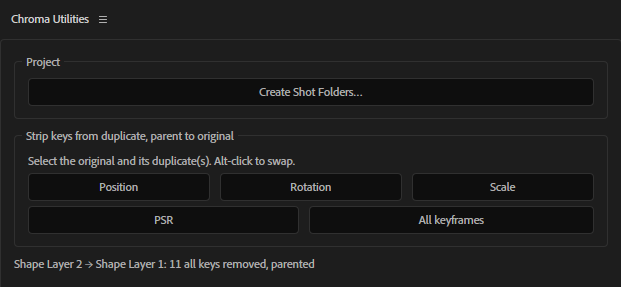
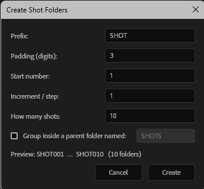
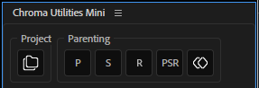
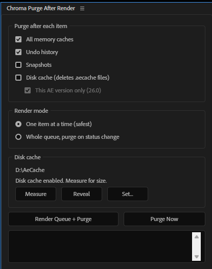

# Chroma Motion Scripts for C4D & AFX

Everything in this repo is free: small scripts for After Effects and Cinema 4D, and the Windows and Deadline tasks around them, written by hand or with AI assistance. If they save you time, please consider taking a look at our paid plugins on [aescripts](https://aescripts.com/authors/chroma/) and [store.chroma.london](https://store.chroma.london/):

- [Gulp - CGI shot builder for AFX](https://aescripts.com/gulp/)
- [VoxMark](https://aescripts.com/voxmark/)
- [VoxMark for Cinema 4D](https://store.chroma.london/l/tdkzz)
- [Redshift Light Manager](https://store.chroma.london/l/zlizze)
- [Redshift ID Manager](https://store.chroma.london/l/vgwstr)
- [Octane to Redshift Converter](https://store.chroma.london/l/oeziqg)
- [SuperSolo for C4D](https://store.chroma.london/l/lxhbxy)
- [Mega Bundle](https://store.chroma.london/l/bjczda)

---

## After Effects

The `aftereffects/` tree mirrors After Effects' own layout, so installing is a straight copy of both folders. `Scripts/` holds things you run once from the File menu; `ScriptUI Panels/` holds dockable panels that live in the Window menu.

### `ScriptUI Panels/Chroma Utilities.jsx`

A dockable panel of small tools. Three so far.



#### Create Shot Folders

Creates a run of numbered shot bins in the Project panel — `SHOT001` … `SHOT010` — from a prefix, zero-padding, start number, step and count.



The step is there for edits that number in tens or twenties so there's room to insert later, and the padding is separate from the start number so `1` can render as `001` without typing leading zeros. A live preview shows the first and last name before you commit, which catches an off-by-one in the count before it becomes forty bins to delete. Optionally the whole run drops inside a parent bin, and the batch is a single undo step.

The same dialog ships standalone as `Scripts/CreateShotFolders.jsx` for File → Scripts. The panel embeds the code rather than looking for that file, so it's a single-file install with nothing to locate on disk.

#### Strip keys from duplicate, parent to original

Duplicate an animated layer, select the original and the duplicate, click a button. The duplicate loses its keyframes and is parented to the original, so it follows the original's animation rather than carrying its own copy of it. Five buttons: **Position**, **Rotation**, **Scale**, **PSR** (all three) and **All keyframes** (everything on the layer — effects, masks, text, shape contents, layer styles — but not markers, and expressions are left alone).

The details that matter:

- **Which layer is the original.** If the names differ only by a trailing number (`Hero` / `Hero 2`, `Shape Layer 1` / `Shape Layer 2`, `SHOT_010` / `SHOT_011`) the un-numbered or lowest-numbered one is the original. Otherwise it's the lowest selected layer in the stack, because Ctrl/Cmd+D puts the copy directly above its source. Hold **Alt** (Option) while clicking to swap. The status line says which way it went.
- One original with several duplicates works — select them all.
- Each stripped property holds its value at the current time, the same as switching the stopwatch off, so the duplicate keeps whatever pose it had when you clicked.
- Parenting uses After Effects' own compensation (no jump), so the duplicate stays put on screen. After a full PSR strip its transform ends up relative to the original, which is the point.
- Position covers separated X/Y/Z too; Rotation covers X/Y/Z and Orientation on 3D layers.
- Every click is one undo step.

#### Transfer expressions

Copies expressions from one layer to others: the expressions only, never keyframes or values. Click the source layer, Ctrl/Cmd-click each target, then click **Transfer**. One source can go to any number of targets in a single click.

- **Whole layer or one property.** With only layers selected, every expression on the source is copied: transform, effects, masks, shape contents, text animators. Select a property on the source first (Position, say, or a whole effect or shape group) and only the expressions it covers are copied.
- **Which layer is the source.** Whichever selected layer has expressions to give. If more than one does, as when re-running after an earlier transfer, it's the one you clicked first, since After Effects reports layers in the order they were selected. Hold **Alt** (Option) to use the one clicked last instead.
- **How properties are matched.** Each property is found on the target by where it sits in the layer, using match names, so it works across renamed layers and in any interface language. Effects, masks and shape groups are matched by name, then by position, and must be the same kind either way, so a blur's expression never lands on some other effect that happens to be second in the stack.
- **Nothing is created.** If a target lacks the property (most often an expression control the source has and the target doesn't) that expression is skipped and the status line lists it. An expression that goes on but can't evaluate on the target, typically because it refers to an effect the target is missing, is listed too.
- Expressions are copied as written, so one that refers to a layer or effect by name still refers to that name on the target.
- An expression that is switched off on the source arrives switched off.
- A target's existing expressions are replaced only where the source has one; the rest are left alone.
- Every click is one undo step.

### `ScriptUI Panels/Chroma Utilities Mini.jsx`

The same three tools as one row of square buttons, for docking in a strip above the timeline or down the side of the Project panel where a full-width panel won't fit.



Three outlined sections: **Project**, holding the Create Shot Folders button; **Parenting**, holding **P**, **S**, **R**, **PSR** and a keyframes icon for every keyframe on the layer; and **Expressions**, holding the transfer button (`=→`). No status line — the result is visible in the comp, so success is silent. Only a refused parent, or an expression that was skipped or won't evaluate on its target, raises a dialog. Everything else behaves exactly as the full panel does, Alt-click included.

Both panels can be installed side by side; they are independent, and the mini one carries its own copy of the tool code so it stays a single file. The icons are embedded in the script as PNG bytes rather than sitting in a folder beside it, for the same reason.

Every button is drawn by one `onDraw` function, so they cannot drift apart. After Effects leaves no way to have it draw them consistently: a ScriptUI `iconbutton` comes out round whatever size it is given, and `graphics.drawOSControl()` — the documented way to ask for the native frame underneath a custom `onDraw` — silently paints nothing, so an icon button ends up with no frame and no rollover. The frame, the rollover and the pressed state are therefore drawn by hand, in colours sampled from After Effects' own buttons and expressed as multiples of the dock background so a different UI brightness carries them with it.

Folder and keyframe icons by Royyan Wijaya, [The Noun Project](https://thenounproject.com/).

### `ScriptUI Panels/Chroma Purge After Render.jsx`

Renders the render queue and purges caches after each item, so a long queue doesn't degrade as memory and the disk cache fill up.



Two modes, because they trade against each other:

- **One item at a time** — parks the queue, renders a single item, purges, repeats. The purge never lands while the render engine is mid-frame. Slightly slower, since each item pays its own `render()` startup.
- **Whole queue** — hands everything to After Effects in one `render()` call and purges from each item's `onStatusChanged` callback. Faster between items, but the purge runs while AE is still inside the render.

Memory caches, undo and snapshots go through `app.purge()`. The disk cache has no scripting API at all — Adobe never exposed the Empty Disk Cache button — so it is cleared by deleting the cached frames directly.

That means the cache location matters, and it is nearly always moved off the default onto a fast scratch drive. The panel reads it from preferences at runtime rather than assuming a path. The preference key carries a version suffix that Adobe bumps between releases (`Folder 7` in 26.0), so it probes the range and takes the first hit; if resolution ever fails there's a **Set…** override that persists. The panel also measures the cache, and reveals the folder.

Two constraints on deletion, which matter if the cache root is pointed somewhere populated: only files ending `.aecache` are removed, and only ones inside a `*.noindex` folder. Directories are never touched — After Effects reuses the empty `00`–`ff` buckets.

Worth knowing before relying on it: deleting cached frames under a running After Effects leaves its cache index referencing frames that are gone. AE handles the miss by re-rendering, so nothing breaks, but it is not identical to the Preferences button. If the real goal is that a long queue shouldn't degrade at all, one `aerender` process per item is the stronger answer — the process exits and the OS reclaims everything, with nothing left to purge.

Settings persist between sessions via `app.settings`.

### Installing the After Effects scripts

Copy the contents of `aftereffects/` into the matching folders inside the After Effects install:

```
Windows   C:\Program Files\Adobe\Adobe After Effects <ver>\Support Files\Scripts\
macOS     /Applications/Adobe After Effects <ver>/Scripts/
```

Needs administrator rights on Windows. Scripts placed here survive After Effects updates.

Restart After Effects afterwards. Panels then appear at the bottom of the **Window** menu; plain scripts under **File → Scripts**.

`Chroma Purge After Render` needs **Preferences → Scripting & Expressions → Allow Scripts to Write Files and Access Network** enabled before it can clear the disk cache. Everything else in it works without that.

### `plugins/vr_color_gradients_3d/`

An effect plugin — C++ rather than a script — that does what After Effects' own **VR Color Gradients** does, with one addition: **every gradient point carries a Z axis**, so the points sit in 3D space instead of being pinned to the surface of the sphere.

Adobe's version gives each of its eight points a direction only. You can move a colour around the 360 frame, but not change how far its influence spreads — the falloff exponent is global, so tightening one point tightens all of them. A distance per point makes spread a local property.

#### Why Z = 0 changes nothing

A gradient point is treated as a position rather than a direction, `P = radius * direction`, and the falloff uses the real 3D distance from that point to wherever the pixel's ray meets the unit sphere:

```
|P - d|^2  =  radius^2 + 1 - 2 * radius * (direction . d)
```

At `radius == 1` that collapses to the chord distance `2*sin(theta/2)` — a pure angular falloff, which is exactly how a point stuck to the sphere behaves. So `Z = 0` reproduces a flat gradient *exactly*, and the Z axis is strictly additive: it can never shift a look you already had.

Pull a point inward and its distance to every direction evens out, so its colour blooms wide across the sphere. Push it outward and the colour tightens into a hotspot.

#### Two point spaces, one set of controls

Each point is a single 3D point parameter; a **Point Space** popup decides how its X/Y/Z is read, rather than doubling eight points' worth of UI.

- **Equirect + Distance** — X/Y is the position in the equirect frame in pixels, draggable on the canvas exactly as Adobe's is, and Z is depth: `radius = 1 + Z / Depth Scale`. A drop-in.
- **World XYZ** — Cartesian, viewer at the centre of the frame, with direction *and* falloff derived from the vector. After Effects' Y axis points down and is flipped internally, so expression-linking a point to a 3D null's `position` behaves the way you'd expect. That is the reason the mode exists: the gradient can be driven by something you animate in the 3D viewport.

The rest matches the original — frame layout (monoscopic or either stereo pair), horizontal and vertical field of view, 1–8 points with a colour each, a falloff exponent, opacity and the usual blending modes. **Gradient Blend** at 0 % collapses the mix to hard Voronoi cells, which is useful on its own.

Unlike Adobe's, which is GPU-only and refuses to render without acceleration, this one is a CPU smart-render effect: 8-, 16- and 32-bit, float-aware, multi-threaded, and it works with GPU acceleration switched off.

This is an independent implementation of the standard maths — equirectangular projection plus inverse-distance-weighted interpolation. No Adobe code is reproduced.

#### Building and installing it

Source only; there's no binary in the repo. It needs the After Effects SDK and MSVC, then:

```powershell
.\build.ps1 -Install     # builds, then copies into After Effects (elevates)
```

SDK, Visual Studio and After Effects locations are all parameters — pass your own if the defaults don't match. The resulting `.aex` belongs in `Support Files\Plug-ins\Effects\`, where it survives After Effects updates, and needs a restart. The effect then appears under **Effect → Immersive Video**.

The geometry, interpolation and blend modes live in a header with no After Effects types in it, so `tests/` compiles and runs them under plain `g++` — including an offline renderer that writes equirect stills. Its [README](plugins/vr_color_gradients_3d/README.md) covers the parameters in full, and the SDK and scripting traps worth knowing about, among them a bug in the SDK's own `PF_ADD_POINT_3D` macro, which discards the Z default you pass it.

---

## Cinema 4D

Run from **Extensions → User Scripts**. See [Installing the Python scripts](#installing-the-python-scripts) below.

The `-OM2XP` / `-XP2OM` suffixes are direction: Object Manager → XPresso, and back again.

### `find_xpresso_node-OM2XP.py`

Select an object (or tag) in the Object Manager, run the script, and it selects the XPresso node(s) that reference that object.

It searches **every** XPresso tag in the scene, so you don't need to know which rig the object is wired into or have the right tag selected first. Nodes nested inside XGroups are found too. Matching is on object identity first, falling back to a name match if nothing exact turns up — useful in a rig with several objects called `Sweep`. If nothing matches, it prints every node and what it references so you can see why.

It then opens the XPresso editor on the right graph and **jumps straight to the node** — centred on screen and zoomed in, ready to work on. No hunting around a 2,000-unit-wide graph for a highlighted box.

The zoom level is yours to set. Open the script and change `CENTRE_ZOOM` near the top:

```python
CENTRE_ZOOM = 2.0     # 200%. 1.0 = 100%, 0.5 = zoomed out, 4.0 = right in
```

Where several graphs matched, the first is shown and the rest are named in the console — their nodes stay selected, so switching to one of those tags shows the selection already made.

Written for a 61-node rig (since grown to 80) where hunting for "which node drives this null?" by eye was the bottleneck.

<sub>How the centring works, and the several obvious approaches that don't: [docs/xpresso-api-notes.md](docs/xpresso-api-notes.md).</sub>

### `select_xpresso_reference-XP2OM.py`

The reverse lookup. Select node(s) in the XPresso editor, run the script, and it selects whatever they reference — object, tag or material — in the Object Manager or Material Manager.

It expands collapsed hierarchy on the way, so the target is actually visible on screen rather than selected somewhere inside a folded group. Handles multiple selected nodes across multiple graphs at once, de-duplicates targets, and prints the full path of everything it selected.

### `probe_xpresso_view.py`, `probe_xpresso_commands.py` — diagnostics

Not tools, but the instruments that worked the view transform out, kept because the same questions will come up again.

`probe_xpresso_view.py` reads and writes zoom, view position and the root XGroup's position, reporting each separately so they can't be confused. `probe_xpresso_commands.py` enumerates every command plugin and logs which are enabled, which is how "XPresso registers no view commands at all" was established rather than assumed.

### One at a time, not all at once

The next two both exist for the same reason: **they apply an operation to each selected object individually, instead of treating the selection as one thing.** That's the difference between doing something fifty times and doing it once to fifty objects, and Cinema 4D gives you the second when you usually want the first.

#### `multiple-instances_from_multiple-selected.py`

An Instance of **every** selected object, one each, named `<original>_instance`.

Select fifty objects and you get fifty instances — not one instance of the first, and no clicking through them one at a time. Beyond the batching:

- Each instance is inserted as a **sibling directly after its source**, so the hierarchy stays readable instead of everything piling up at the bottom of the Object Manager.
- It copies the source's relative **and frozen** P/R/S, so each instance lands exactly on top of its original rather than at the parent's origin. That's the part that's fiddly to get right by hand.
- The whole batch is **one undo step**.
- The selection is swapped to the new instances afterwards, so you can move them straight away.

#### `connect_&_delete_multiple_selected_objects.py`

**Connect Objects + Delete** run on each selected object individually, rather than merging the whole selection into one mesh.

C4D's built-in command collapses a multi-object selection into a single object — which is right when you want one mesh, and wrong when you have fifty separate assemblies to flatten. This iterates instead: fifty selected nulls with children become fifty connected meshes, each keeping its own identity. `c4d.EventAdd()` fires once at the end so the Object Manager redraws cleanly.

### `plugins/chroma_utilities/`

A background listener that starts with Cinema 4D and runs for the whole session — no button, nothing to launch. It does five things, each switchable on its own.

**Parent renamer.** A generator takes the name of the object you put inside it. Alt-click Extrude on a spline called `Logo Outline` and you get an Extrude called `Logo Outline`, not `Extrude`. Works for any generator type, and for children dragged in later — it watches for the result rather than for the click.

**Text object renamer.** Spline Text and MoText objects name themselves after the first four words of their own text, and keep up as you edit. `Welcome to the show tonight` becomes `Welcome to the show`.

**Auto-enumerator.** Duplicates count up properly instead of collecting C4D's `.1` suffix: `Light` → `Light_02` → `Light_03`. Whatever numbering the original used is normalised onto the same form, and matching children are renumbered alongside their parent, so duplicating `Camera 02` containing `target 02` gives `Camera_03` containing `target_03`. Replaces Romain Rosi's Smart Increment — don't run both.

**Multi-wire.** Select several XPresso nodes, drag a connection onto a port of one of them, and the same connection is made on all of them — one drag instead of twenty when wiring a rig control into a row of nodes. Disconnecting mirrors too, with a prompt about removing the emptied port. Ports are created when the node accepts them, and existing connections are replaced.

**Duplicate-wire.** Copy an XPresso node and it keeps whatever was feeding it, instead of arriving with every input empty. Only incoming connections — an XPresso input port holds one wire, so reconnecting the copy's output would unplug the original rather than duplicate anything. Duplicating a whole selection works too: the wires between the copied nodes survive on their own, and only the inputs from outside are put back. It never replaces a connection that's already there.

The three renamers only ever touch a name that's still the type default or one the plugin assigned itself, so a hand-typed name is safe, and everything already in a document when it opened is left alone. Settings are constants at the top of the `.pyp`. See [its README](plugins/chroma_utilities/README.md) for the full rules, install and limitations.

Installs to `plugins\`, not `library\scripts\`. Ships as a compiled `.pypv`; the `.pyp` source is kept private.

### Installing the Python scripts

Drop the `.py` files from `cinema4d/` into your Cinema 4D script folder:

```
%APPDATA%\Maxon\Maxon Cinema 4D 2026_<hash>\library\scripts\
```

They appear under **Extensions → User Scripts**, where they can be bound to a keyboard shortcut or dragged onto a palette.

Cinema 4D caches script files aggressively. If an edit doesn't appear to take effect, reload scripts or restart before assuming the change didn't save.

---

## Windows

Double-click to run. All of them prompt for their input, so there are no arguments to remember. `C4D_migration.bat` lives here rather than under `cinema4d/` because it's a Windows batch file that happens to move a C4D install around — nothing in it runs inside Cinema 4D.

### `C4D_migration.bat` — legacy

> **Superseded.** A cross-platform replacement is in development: **C4D Migrator**, a Python tool that auto-detects installed C4D versions, reads `version.h` for the real version numbers, skips C++ plugins on major-version migrations because they won't load anyway, discovers external plugin folders from `plugins.json`, lets you opt in and out of each category from a UI, and writes an HTML report of what it did. This batch script is preserved here, and in that project's `docs/`, as the thing it replaces.
>
> Still fine to use on Windows in the meantime — it works, it just hardcodes a lot.

Migrates a Cinema 4D setup from one release to the next.

Prompts for the old and new release numbers plus the unique install hash from each `%APPDATA%\Maxon\Maxon Cinema 4D <ver>_<hash>` folder, then copies across `new.c4d` (the default scene), user scripts, keyboard shortcuts, browser catalogs, layouts and plugins — from both the AppData and Program Files locations.

It then creates junctions from the commandline (`_x`) and Team Render (`_c`) preference folders back into the main plugins folder for **Greyscalegorilla**, **Motion Manager** and **MSLiveLink**, so render nodes see the same plugins as the workstation without a second copy on disk. Edit that block if you run a different plugin set.

### `run_deadline_custom_delay.bat`

Delayed Deadline Worker startup for a workstation you're about to use yourself.

Kills `deadlinelauncher.exe` and `deadlineworker.exe`, asks how many minutes to wait, counts down, then relaunches both. Use it to take a machine out of the farm for a couple of hours without having to remember to put it back. Assumes a default Deadline 10 install path (`C:\Program Files\Thinkbox\Deadline10\bin`).

### `system shutdown.cmd`

Prompts for a delay in minutes, then shuts the machine down. For leaving an overnight render with a clean end.

### `system standby.cmd`

Same, but suspends to standby instead of shutting down, via `powrprof.dll,SetSuspendState`.

---

## Compatibility

The After Effects scripts were written against **After Effects 2026** using ExtendScript and the classic `app` API. They use only the `File`/`Folder` API for disk work — no shell calls and no platform branches — so they run on macOS and Windows alike. Anything version-dependent, notably the disk cache preference key, is probed at runtime rather than hardcoded.

The XPresso scripts were written and tested against **Cinema 4D 2026 / Python 3.11**, using the classic `c4d` API and `c4d.modules.graphview`. Several API surfaces changed in ways that break older forum examples — those differences are documented in [docs/xpresso-api-notes.md](docs/xpresso-api-notes.md), which is worth reading before writing any new XPresso tooling.

`VR Color Gradients 3D` is a compiled effect plugin rather than a script, built against the **After Effects SDK 25.6** and shipped as source. The build script is Windows/MSVC; the source itself is portable and carries the Mac entry points in its PiPL, but only the Windows build has been exercised.

The batch and command files are Windows-only.
